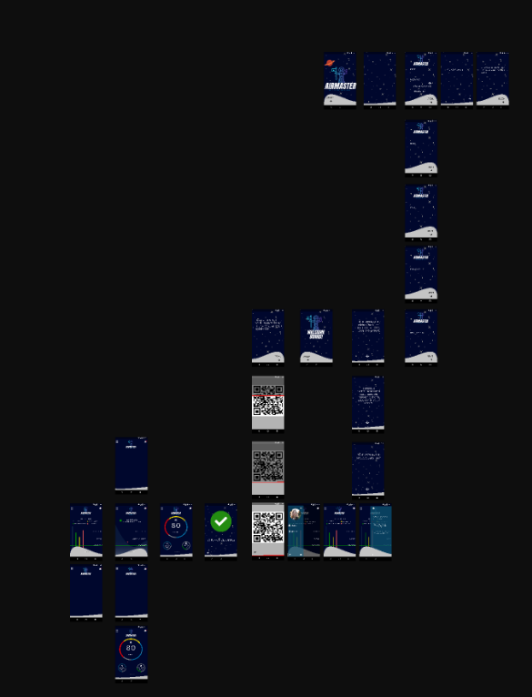
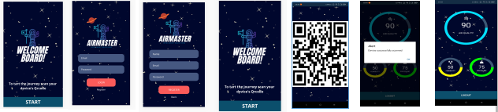

# Space App -  ApoloCoders

* [1. Preface](#1)
* [2. Project summary](#2)
* [3. App](#3)

***
## 1. Preface 

The challenge - Purify the Air Supply
Has internal time increased during the COVID-19 pandemic as a result of stay-at-home policies around the world? Your challenge is to use the International Space Station (ISS) as an inspiration and develop a system to monitor and / or purify indoor air. It is up to you to decide whether the system you design can be used on Earth (for example, in homes, businesses, transportation, etc.) and / or in space.

Many people are unaware that there are not only standards for indoor air quality, but also indoor air quality standards to benefit human health in our homes and other indoor spaces.

NASA astronauts are very familiar with the importance of indoor air quality in the confinement of spacecraft. The composition of the air at the International Space Station (ISS) is taken very seriously, as it can literally make the difference between life and death. NASA developed air filtration techniques to remove harmful particles from the air (to protect equipment from lunar dust, for example) and maintain a favorable mixture of gases to ensure the well-being of the crew.

Your challenge is to use the ISS as an inspiration and develop a system to monitor and / or purify the indoor air. It is up to you to decide whether the system you design can be used on Earth (for example, in homes, businesses, transportation, etc.) and / or in space.

 ## 2. Project 

We are the ApoloCoders team and we have developed an intelligent solution for monitoring air quality.
Using the technology already existing in the air filtration of the Life Support System of spacecraft, we propose the use of copper alloys with biocidal action in the air ventilation of the ship together with the use of intelligent sensors that performed the air monitoring in real time ensuring the preservation of the environment against possibly lethal organisms, good air quality, humidity and atmospheric pressure.                                               
 

    
access to pitch:
<a href="./docs/pitch.pdf">PITCH</a>

## 3. App

The app was developed in the javascripts programming language and using the React Native framework.   
Prototype:

    

App:

    

to access the app: 
   * To access the project do a fork or a clone.
   * Install the dependencies with the command in the `npm install` terminal.
   * To check your application, do a `npm start` in the terminal and it will show the url to access your web server` http: // localhost: 5000`.

collaborators:    
Carlos Oliveira - Back-End Development - https://www.linkedin.com/in/carlos-filho-92401718/ 
Carlos Vitor - Back-End Development -https://www.facebook.com/carlosvitor.limadeoliveira   
Bruna Lima - Business -          
Mariana Barros - Front-End Development - www.linkedin.com/in/marianambarros      
Vitoria Regina - Designer - https://www.linkedin.com/in/vitoriaregina/

